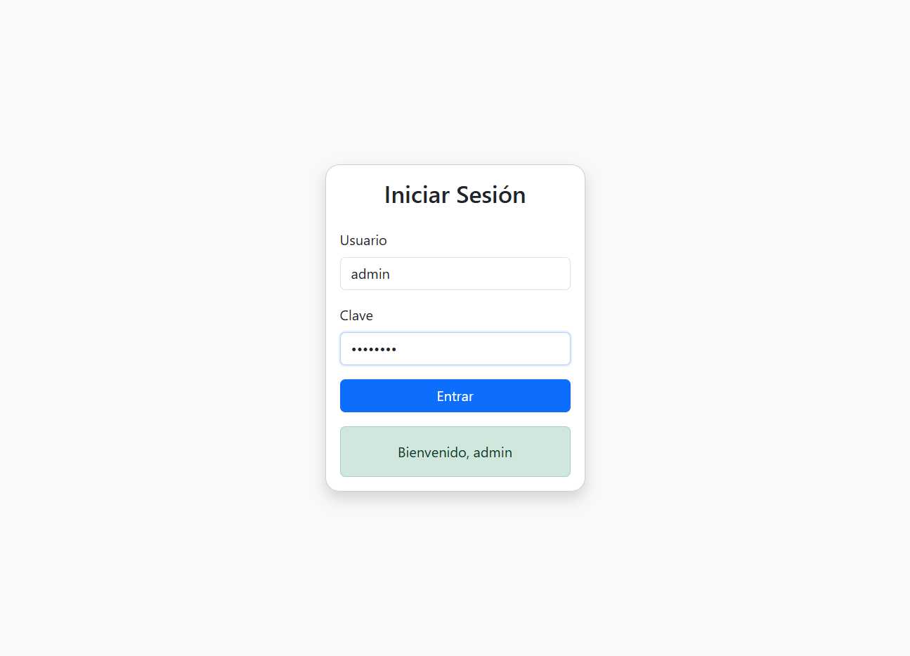

# 🧪 BDD Login Project

## 🚀 Proyecto

🔧 **Imagen Screenshots**:


1. Crea un proyecto Maven: `bdd-login-project`.


2. `login.feature`:
```gherkin
Feature: Acceso a la plataforma bancaria
  Scenario: Login exitoso con credenciales válidas
    Given que el usuario está en la página de login
    When escribe su nombre "admin" y su clave "admin123"
    Then debería ver el mensaje "Bienvenido, admin"

